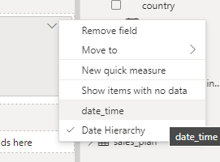
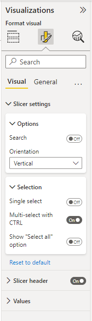

V některých případech může Python posloužit při načtení větších souborů, např. se souborem o uživatelských registracích `user_registration.json`, který je ke stažení [zde](https://raw.githubusercontent.com/pesikj/progr2-python/master/python-pro-data-1/power-bi/assets/user_registration.json). Efektivnější je využití Python skriptu jako zdroje a načtení souboru pomocí funkce `read_json()` modulu `pandas`.

Sloupec `date_time` převeď na typ `Date/Time`. Dále vytvoř kopii tohoto sloupce pomocí volby `Duplicate column`, kterou získáš po kliknutí pravým tlačítkem na název sloupce. Nový sloupec vhodně přejmenuj a převeď na typ `Date`.

1. Vytvoř čárový graf, který zobrazuje vývoj počtu registrací v čase. Protože jde o krátkou časovou řadu, namísto hierarchie použij přímo sloupec `date_time` (viz obrázek níže).
1. Vytvoř graf kumulativního počtu uživatelů.
1. Vývojář aplikace tě informoval, že kvůli bugu se některé e-maily v registraci objevují opakovaně. Podívej se, zda při transformaci dat existuje nějaká možnost, jak tyto duplicity odstranit.
1. Pomocí vhodné vizualizace prezentuj, který marketingový kanál přinesl nejvíce uživatelů.

{.fig}

Na svůj report přidej nástroj `Slicer`. Nejedná se o klasickou vizualizaci, ale filtr, který umožňuje uživateli vybrat, která data jsou v reportu zobrazena. Nastav `Slicer` tak, aby si uživatel s jeho pomocí mohl zobrazit data pouze pro vybranou věkovou skupinu. Vyzkoušej si různá nastavení filtru např. tak, aby uživatel nemusel používat klávesu `Ctrl` při výběru většího množství možností.

{.fig}
