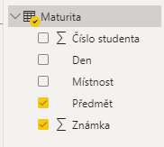
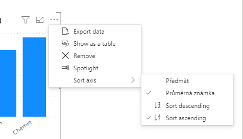
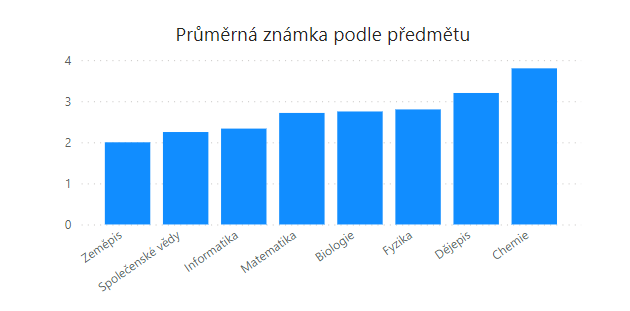
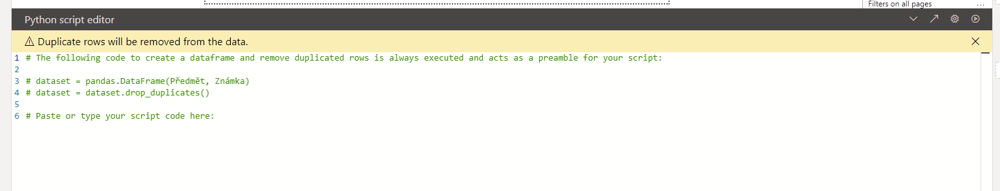
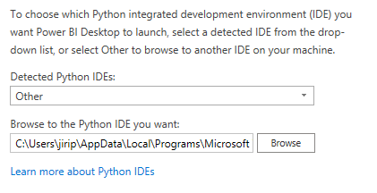
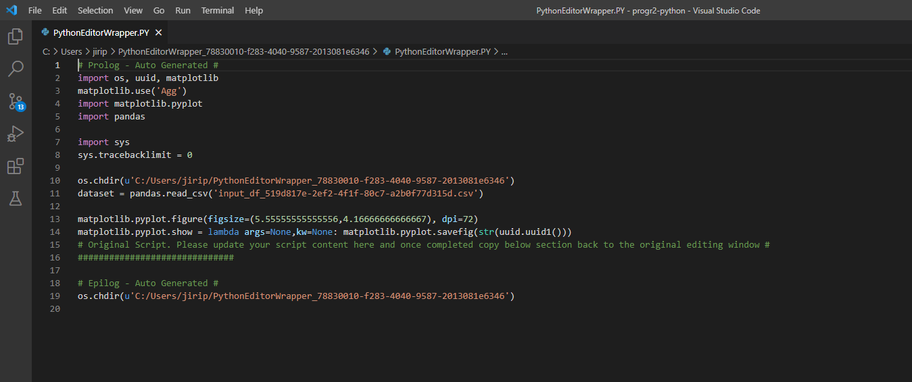

[Power BI](https://powerbi.microsoft.com/en-au/) je nástroj vyvinutý společností [Microsoft](https://www.microsoft.com/cs-cz/), který slouží k tvorbě vizualizací a reportů. V Power BI si uživatel může tvořit interaktivní grafy a reporty podobně snadno, jako grafy v Excelu. Snahou vývojářů Power BI je zpřístupnit a umožnit analýzu dat široké skupině uživatelů, včetně uživatelů bez výrazných technických znalostí.

Power BI se skládá ze dvou částí - Power Query na práci s daty (čtení dat z různých zdrojů, jejich propojování, transformace atd.) a prostředí pro tvorbu reportů a vizualizací na základě dat z Power Query.

Z rodiny Power BI produktů je klíčový desktopový klient Power BI Desktop, který je pro platformu Microsoft Windows k dispozici zdarma. Doporučeným způsobem instalace je instalace prostřednictvím Windows Store, lze však použít i klasický způsob pomocí instalačního souboru. Dále existuje klient pro mobilní telefony a několik služeb, které umožňují spouštět Power BI reporty ve webovém prohlížeči a např. je sdílet napříč organizací. V případě desktopového klienta je možné report sdílet klasicky jako soubor (např. e-mailem).

Galirie veřejně dostupných reportů v Power BI je k dispozici [zde](https://community.powerbi.com/t5/Galleries/ct-p/PBI_Comm_Galleries).

## Power BI a Python

Před začátkem práce je vhodné zkontrolovat nastavení Power BI a propojení s jazykem Python.

### Nastavení

Power BI obvykle zvládne najít instalaci Pythonu. Před začátkem práce je ale dobré si nastavení zkontrolovat. Otevřeme si menu `File -> Options and Settings -> Options` a v dialogovém okně zvolíme `Python Scripting`. V menu `Detected Python home directories` je přehled instalací Pythonu, které byly Power BI detekovány.


Pokud není požadovaná instalace na výběr, můžeme zvolit možnost `Other` a zadat adresář s požadovanou instalací ručně.


### Příklady užití

Přestože má Power BI k dispozici nástroj Power Query, v řadě případů může být vhodné využít skripty v jazyce Python. Typické příklady využití jsou následující:

- Máme k dispozici již hotový program nebo skript na zpracování dat a chceme výsledky zobrazit v prostředí Power BI.
- Operace, kterou chceme provést, je v prostředí Power BI příliš komplikovaná (nebo nemožná), zatímco v modulu `pandas` jednoduchá.
- Distribuce modelů a reportů uživatelům bez hlubších technických znalostí.

## Zdroje dat

Power BI obsahuje samostatnou komponentu Power Query, která slouží pro zpracování dat. Prvním krokem je jejich načtení a získání. Power BI podporuje řadu různých zdrojů:

- soubory (např. ve formátu CSV, XML nebo JSON),
- databáze,
- služby Power Platform a cloudové služby Azure,
- on-line služby (např. Sharepoint, Dynamics 365, Google Analytics, GitHub, Twilio a řada dalších),
- ostatní (např. webové stránky či skripty v jazycích Python a R).

Python tedy můžeme využít jako zdroj dat a do Power BI můžeme například přenést již hotové skripty. Zkusme tedy nejprve přenést do Power BI výsledky maturity, se kterými jsme již pracovali. 

Ve skupině `Other` vybereme jako zdroj `Python script`. Budeme opět využívat modul `pandas`. Data načteme pomocí metody `read_csv`, do které vložíme URL jednotlivých datových souborů.

```
import pandas as pd

u202 = pd.read_csv("https://kodim.cz/czechitas/progr2-python/python-pro-data-1/agregace-a-spojovani/assets/u202.csv")
u203 = pd.read_csv("https://kodim.cz/czechitas/progr2-python/python-pro-data-1/agregace-a-spojovani/assets/u203.csv")
u302 = pd.read_csv("https://kodim.cz/czechitas/progr2-python/python-pro-data-1/agregace-a-spojovani/assets/u302.csv")

```

Po stisknutí tlačítka OK se zobrazí dialogové okno, ve kterém vybereme, které datové zdroje chceme využít. Jednotlivé "zdroje" se v terminologii Power BI označují jako `query` (dotazy).


Pokud vybereme všechny, uvidíme v levé části okna každý ze zdrojů jako samostatnou položku v menu, kterou si můžeme zobrazit.


Nyní bychom mohli pomocí nástrojů Power Query mohli provést stejné transformace (propojení zdrojů, filtrování, případně agregace), abychom se dostali k obdobným výsledkům jako v předchozí části. Níže je například vidět dialog na pro spojení jednotlivých datových souborů.


Efektivnější ale bude využít již připravený kód v jazyce Python a v Power BI pracovat až s připravenými výsledky. Smažme tedy všechny vytvořené dotazy a přidejme nový skript, ze kterého vybereme pouze dotaz `maturita`.

```
import pandas as pd

u202 = pd.read_csv("https://kodim.cz/czechitas/progr2-python/python-pro-data-1/agregace-a-spojovani/assets/u202.csv")
u203 = pd.read_csv("https://kodim.cz/czechitas/progr2-python/python-pro-data-1/agregace-a-spojovani/assets/u203.csv")
u302 = pd.read_csv("https://kodim.cz/czechitas/progr2-python/python-pro-data-1/agregace-a-spojovani/assets/u302.csv")
u202['mistnost'] = 'u202'
u203['mistnost'] = 'u203'
u302['mistnost'] = 'u302'
maturita = pandas.concat([u202, u203, u302], ignore_index=True)
```

Po vyhodnocení výsledků maturity stačí, abychom tabulky propojili dohromady, 
agregace budou vypočteny automaticky při tvorbě vizualizací. Proto klikneme na tlačítko `Close & Apply`.

*Poznámka:* Pokud bychom se k editaci skriptu chtěli vrátit, klikneme na ikonku ozubeného kola v řádku `Source` v panelu napravo.


## Vizualizace

Nyní můžeme vytvořit graf zobrazující průměrnou známku dle předmětu. K vytvoření grafu jsou potřeba následující kroky.

Pokud bychom chtěli názvy sloupců použít jako popisky os grafů, vyplatí se je přejmenovat pomocí volby `Rename`. 



V menu vpravo vybereme typ vizualizace. Pro zobrazení průměru je vhodný například sloupcový graf (`stacked column chart` nebo `stacket bar chart`). Poté zaškrtneme pole Předmět a Známka vpravo. Power Bi automaticky použije textové pole Předmět jako popisek osy a číselné pole předmět pro výšku sloupců. Automaticky počítá součet, proto je nutné změnit typ agregace na průměr.

Dále je možné upravit titulek grafu a popisky os, aby byl graf co nejvíce srozumitelný. Nastavení vzhledu vizualizace provádíme pomocí menu `Format your visual` vpravo. V případě jednoduchého grafu je možné například vyplnit pouze titulek a popisky os vypnout.

Jako poslední možnost můžeme upravit řazení a seřadit předměty vzestupně podle průměru. Možnosti řazení jsou "schované" v menu vizualizace, které otevřeme pomocí ikonky tří teček vpravo nahoře.



Tím je naše první vizualizace hotová.



### Tvorba vizualizací v Pythonu

S pomocí Pythonu můžeme přidat i vizualizace, které budou interaktivně využívat data z dotazů. Pro vytvoření vizualizace klikneme v nabídce vizualizací na možnost `Python visual`. Následně v menu vpravo vybereme sloupce, se kterými chceme pracovat. Pro vybrané sloupce je vhodné nastavit agregaci jako průměr, abychom nemuseli agregaci řešit v kódu.


Následně se nám zpřístupní editor kódu.



Kód pro generování vizualizace můžeme zapisovat přímo do editoru nebo můžeme kliknout na ikonu šipky, která otevře kód ve vybraném vývojovém prostředí. Výběr vývojového prostředí můžeme provést na stejném místě, jako jsme nastavovali cestu k instalaci Pythonu. Jako výchozí je nastavená aplikace, ve které operační systém automaticky otevírá soubory s příponou `.py`. Pokud si chceme vývojové prostředí konkrétně vybrat, vybereme možnost `Other` a nastavíme cestu k vybranému vývojovému prostředí. Power BI si nejlépe rozumí s Visual Studio Code, cestu k němu může být například `C:\Users\jirka\AppData\Local\Programs\Microsoft VS Code\Code.exe`. Pro tvorbu složitějších vizualizací se vývojové prostředí vyplatí použít.



Po kliknutí na ikonu se šipkou se otevře vybrané vývojové prostředí se skriptem, do kterého jsou již vložené nějaké řádky. Power BI vygeneruje adresář, do kterého vloží data v souboru CSV a skript s předpřipraveným kódem.



Nový kód bychom měli vkládat pod řádek komentáře `# Paste or type your script code here:`. Začneme tím, že vygenerujeme prostor pro rázdný graf. Samotný graf se bude skládat z obrázku (`figure`) a souřadnicové osy (`axis`). Obrázek zastřešuje všechny elementy, které jsou součástí grafu. V některých případech se může obrázek skládat z více grafů (`subplot`). V případě maturit bychom například pomocí grafů mohli srovnat průměrné známky z daných předmětů v různých třídách nebo školách.

Pro vytvoření obrázku a souřadnicových os použijeme funkci `subplots()`. Pokud nezadáme žádné parametry, `matplotlib` vytvoří jednu souřadnicovou osu, tj. počítá pouze s jedním grafem na obrázek.

```py
import matplotlib.pyplot as plt
fig, ax = plt.subplots()
```

Oproti Power BI vizualizaci musíme provést agregaci dat. Na tu využijeme již hotový kód. Protože výsledek chceme vidět seřazený dle velikosti, použijeme na agregovanou tabulku metodu `sort_values()`.

```py
dataset = dataset.sort_values("Známka")
```

Dále použijeme metodu `bar` pro vytvoření sloupcového grafu. Aby byl graf vložen do námi připravené souřadnicové osy, jako parametr `ax` nastavíme `ax`. Modul `matplotlib` automaticky vytváří legendu, ta je ale v našem případě zbytečná, parametr `legend` nastavíme na `None`. Parametry `x` a `y` nastavují sloupce, které jsou použity na popisy a výšky řádků. V našem případě by `matplotlib` nastavil parametry automaticky, do budoucna se nám ale změna sloupců může hodit.

```py
dataset.plot.bar(ax=ax, legend=None, x="Předmět", y="Známka")
ax.set_title("Průměrná známka podle předmětu")
```

Popis osy bychom nastavili pomocí metod `set_xlabel()` a `set_ylabel()`. V našem případě nechceme popis osy *x* žádný, zavoláme tedy metodu `set_xlabel()` s parametrem `None`.

```py
ax.set_xlabel(None)
```

Abychom ušetřili místo pod grafem, otočíme popisy jednotlivých hodnot o 45 stupňů. I tak se ale pod graf všechny názvy předmětů nevejdou, proto mírně zvětšíme prostor pod grafem pomocí metody `subplots_adjust()`.

```py
plt.xticks(rotation=45, ha='right')
fig.subplots_adjust(bottom=0.25)
plt.show()
```

### Přidání filtrů

V Power BI jsou reporty interaktivní a jednotlivé prvky na sebe reagují. Typickým příkladem interaktivního prvku je Slicer, který můžeme využít jako filtr. Po vložení prvku `Slicer` do reportu je do pole `Field` nutné přetáhnout pole, podle kterého chceme filtrovat. Můžeme vyzkoušet například pole `Den`.


Následně po výběru jednoho či více dní se překreslí vizualizace a zobrazí pouze data z vybraných dní.


Standardní chování komponenty je umožnit výběr více prvků s využitím klávesy `Ctrl`. Chování komponenty můžeme upravit v pravém panelu po kliknutí na volbu `Format visual`.


## Přidání dalších transformací

Existují transformace, které jsou v Power BI velmi komplikované. Příkladem je vložení hodnot z předcházejícího nebo následujícího řádku do aktuálního. V jazyce SQL se k tomu účelu používají různé zápisy (často funkce `lead()` a `lag()`), v modulu `pandas` se používá metoda `shift()`.

Uvažujme například, že máme k dispozici zařízení, které zapisuje informace o začátku a konci výpadku televizního signálu do textového souboru. Abychom zjistili délku výpadku, potřebujeme porovnat čas začátku a konce výpadku. Protože jsou časy událostí na různých řádcích, využijeme modul `pandas` a metodu `shift()`.
