[Power BI](https://powerbi.microsoft.com/en-au/) je nástroj vyvinutý společností [Microsoft](https://www.microsoft.com/cs-cz/), který slouží k tvorbě vizualizací a reportů. V Power BI si uživatel může tvořit interaktivní grafy a reporty podobně snadno, jako grafy v Excelu. Snahou vývojářů Power BI je zpřístupnit a umožnit analýzu dat široké skupině uživatelů, včetně uživatelů bez výrazných technických znalostí.

Power BI se skládá ze dvou částí - Power Query na práci s daty (čtení dat z různých zdrojů, jejich propojování, transformace atd.) a prostředí pro tvorbu reportů a vizualizací na základě dat z Power Query.

Z rodiny Power BI produktů je klíčový desktopový klient Power BI Desktop, který je pro platformu Microsoft Windows k dispozici zdarma. Doporučeným způsobem instalace je instalace prostřednictvím Windows Store, lze však použít i klasický způsob pomocí instalačního souboru. Dále existuje klient pro mobilní telefony a několik služeb, které umožňují spouštět Power BI reporty ve webovém prohlížeči a např. je sdílet napříč organizací. V případě desktopového klienta je možné report sdílet klasicky jako soubor (např. e-mailem).

Galirie veřejně dostupných reportů v Power BI je k dispozici [zde](https://community.powerbi.com/t5/Galleries/ct-p/PBI_Comm_Galleries).

## Power BI a Python

Před začátkem práce je vhodné zkontrolovat nastavení Power BI a propojení s jazykem Python.

### Nastavení

Power BI obvykle zvládne najít instalaci Pythonu. Před začátkem práce je ale dobré si nastavení zkontrolovat. Otevřeme si menu `File -> Options and Settings -> Options` a v dialogovém okně zvolíme `Python Scripting`. V menu `Detected Python home directories` je přehled instalací Pythonu, které byly Power BI detekovány.

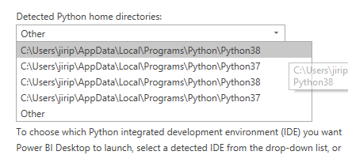{.fig}

Pokud není požadovaná instalace na výběr, můžeme zvolit možnost `Other` a zadat adresář s požadovanou instalací ručně.

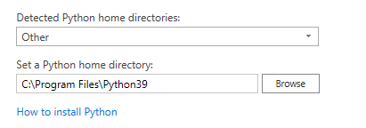{.fig}

### Příklady užití

Přestože má Power BI k dispozici nástroj Power Query, v řadě případů může být vhodné využít skripty v jazyce Python. Typické příklady využití jsou následující:

- Máme k dispozici již hotový program nebo skript na zpracování dat a chceme výsledky zobrazit v prostředí Power BI.
- Operace, kterou chceme provést, je v prostředí Power BI příliš komplikovaná (nebo nemožná), zatímco v modulu `pandas` jednoduchá.
- Distribuce modelů a reportů uživatelům bez hlubších technických znalostí.

## Zdroje dat

Power BI obsahuje samostatnou komponentu Power Query, která slouží pro zpracování dat. Prvním krokem je jejich načtení a získání. Power BI podporuje řadu různých zdrojů:

- soubory (např. ve formátu CSV, XML nebo JSON),
- databáze,
- služby Power Platform a cloudové služby Azure,
- on-line služby (např. Sharepoint, Dynamics 365, Google Analytics, GitHub, Twilio a řada dalších),
- ostatní (např. webové stránky či skripty v jazycích Python a R).

### Nahrání dat z CSV souboru

Začněme tím, že si zkusíme do Power BI nahrát soubor [sales_actual.csv](https://raw.githubusercontent.com/pesikj/progr2-python/master/python-pro-data-1/power-bi/assets/sales_actual.csv), který zobrazuje data o uzavřených kontraktech fiktivní firmy. U každého kontraktu vidíme datum uzavření, název zákazníka, stát, ve kterém sídlí, hodnotu kontraktu a odpovědného obchodníka.

Soubor nejprve uložíme na disk, poté v menu Get Data vybereme Text/CSV a najdeme soubor `sales_actual.csv`. Následně klikneme na tlačítko `Load`.

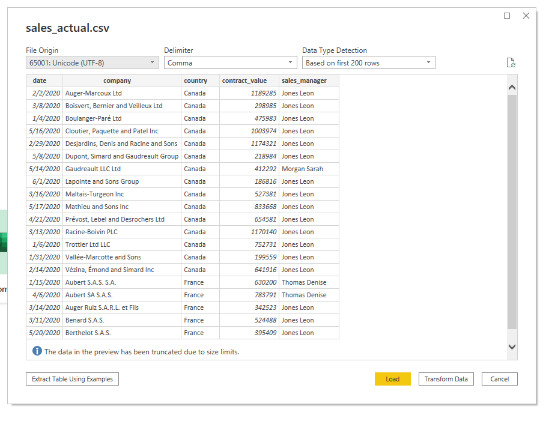{.fig}

Zkusme si hned vytvořit vizualizaci, aniž bychom data nějak upravovali. Můžeme například vytvořit graf hodnoty uzavřených kontraktů po jednotlivých měsících. K zobrazení dat stačí přetáhnout soupec `contract_value` do sloupce `Values` a sloupec `Date` do pole `Axis`.

Všimněte si dvou ikonek:
- Ikonka sumy u sloupce `contract_value` značí, že sloupec je číselná hodnota a přetáhneme-li ho do pole `Values`, automaticky dojde k součtu hodnot.
- Ikonka kalendáře u sloupce `Date` znamená, že byl sloupec identifikován jako sloupec obsahující datum. Automaticky je u něj vytvořena hierarchie s úrovněmi Rok -> Čtvrtletí -> Měsíc -> Den.

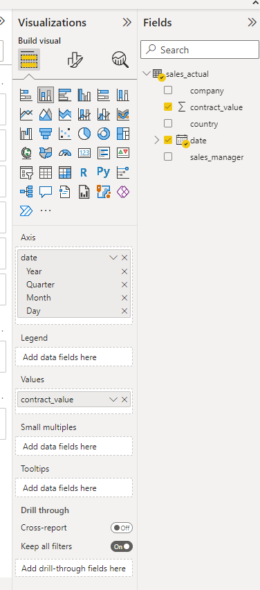{.fig}

Jedním ze základních úkonů v Business Intelligence a v datové analýze obecně je přesun mezi úrovněmi detailu. Začneme tedy na nejvyšší úrovni a postupně se přesunujeme na vyšší úroveň detailu. Můžeme si vybrat přesun na vyšší detail pro jeden prvek (např. pro jedno čtvrtletí) nebo pro všechny. K tomu slouží ikony jedné a dvou šipek vpravo nahoře u grafu.

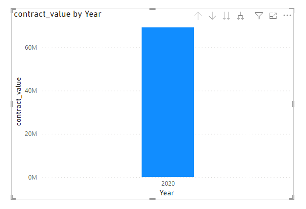{.fig}

U tržeb často sledujeme kumulativní součet, který sleduje nárůst tržeb firmy v průběhu jednoho roku. K tomu můžeme využít tzv. `Quick Measure`, které umožňují přidat nové sloupce s výpočty. Můžeme přidat výpočet typu `Running Total`, což je anglický ekvivalent pro kumulativní součet. Pro vytvoření klikneme na ikonu tří teček u názvu tabulky a vybereme `New Quick Measure`.

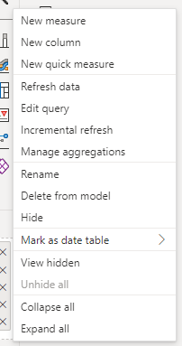{.fig}

Kumulativní součty musíme vytvářet pro konkrétní prvky hiearchie. Nejčastěji sledujeme tržby po měsících, vybereme tedy pole `date - Month`.

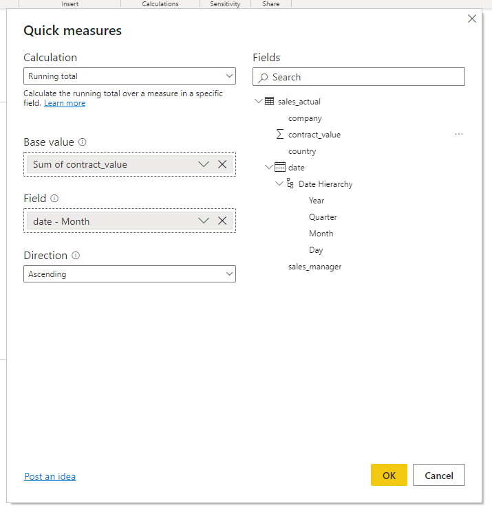{.fig}

Tím získáme graf kumulativního součtu tržeb za jednotlivé dny.

Graf je dále vhodné vylepšit přidáním popisků os a titulku. Obojí lze provést v menu `Format visual`.

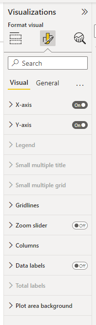{.fig}

[[[ excs Cvičení
- legenda
- donut
- funnel
]]]

[[[ excs Bonusové cvičení
- barvy
]]]

## Transformace dat

Uzavřené smlouvy jsou často porovnávány s plánem, aby bylo jasné, zda hodnoty uzavřených kontraktů dosahují požadové úrovně. Tabulka s plánem tržeb je ke stažení [zde](https://raw.githubusercontent.com/pesikj/progr2-python/master/python-pro-data-1/power-bi/assets/sales_plan.csv). Tabulku importujeme do Power BI jako nový zdroj.

Tabulka má data zadaná jako čísla - číslo roku a číslo měsíce. Abychom mohli zobrazit obě hodnoty v jednom grafu, potřebujeme k tabulce s plánem přidat datum. Kliknutím na tlačítko `Transform data` otevřeme nástroj Power Query, kde můžeme provádět různé transformace dat.

Nejprve přidáme sloupec s datem. Klikneme na tlačítko `Custom column`, které nám umožní přidat sloupec s hodnotou spočítanou na základě ostatních funkcí. V počítaných sloupcích můžeme využít balík více než 700 funkcí, které jsou popsány [v dokumentaci](https://docs.microsoft.com/en-us/powerquery-m/power-query-m-function-reference). V našem případě využijeme funkci [#datetime](https://docs.microsoft.com/en-us/powerquery-m/sharpdatetime).

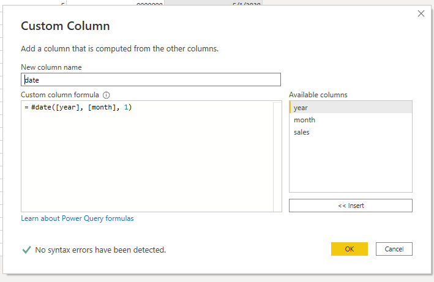{.fig}

Po zavolání funkce bychom měli zkontrolovat typ hodnoty ve sloupci. Pokud není nastaven jako `Date`, provedeme převod pomocí menu `Change Type`.

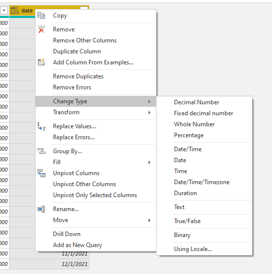{.fig}

Jako poslední krok spojíme obě tabulky dohromady. Nejjednodušší je použití tlačítka `Append Queries`, což je obdoba operace UNION v jazyce SQL nebo funkce `concat()` v modulu `pandas`. 

Nyní můžeme přidat vizualizaci `Lined and Stacked column chart` a porovnat, nakolik se obchodníkům daří plnit obchodní plán.

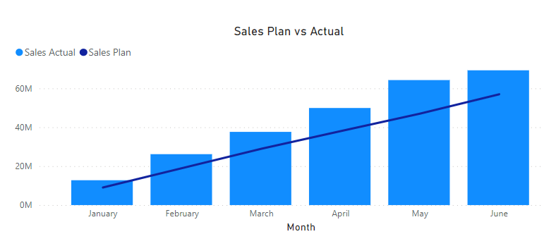{.fig}

### Využití Pythonu jako zdroje

Python můžeme využít jako zdroj dat a do Power BI můžeme například přenést již hotové skripty. Zkusme tedy nejprve přenést do Power BI výsledky maturity, se kterými jsme již pracovali. 

Ve skupině `Other` vybereme jako zdroj `Python script`. Budeme opět využívat modul `pandas`. Data načteme pomocí metody `read_csv`, do které vložíme URL jednotlivých datových souborů.

Po stisknutí tlačítka OK se zobrazí dialogové okno, ve kterém vybereme, které datové zdroje chceme využít. Jednotlivé "zdroje" se v terminologii Power BI označují jako `query` (dotazy).

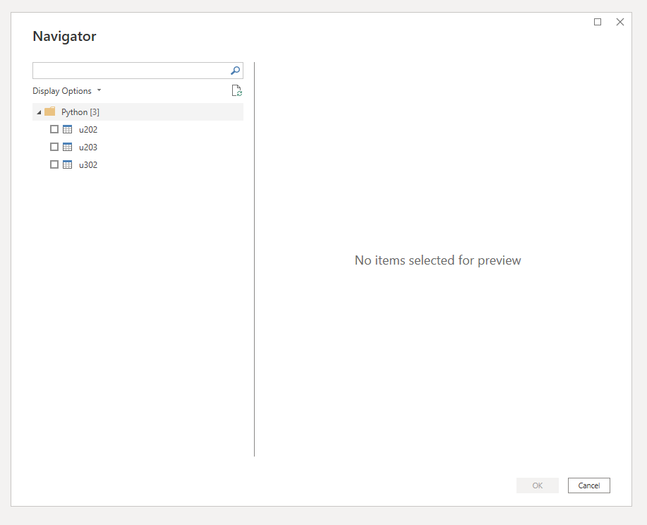{.fig}

Pokud vybereme všechny, uvidíme v levé části okna každý ze zdrojů jako samostatnou položku v menu, kterou si můžeme zobrazit.

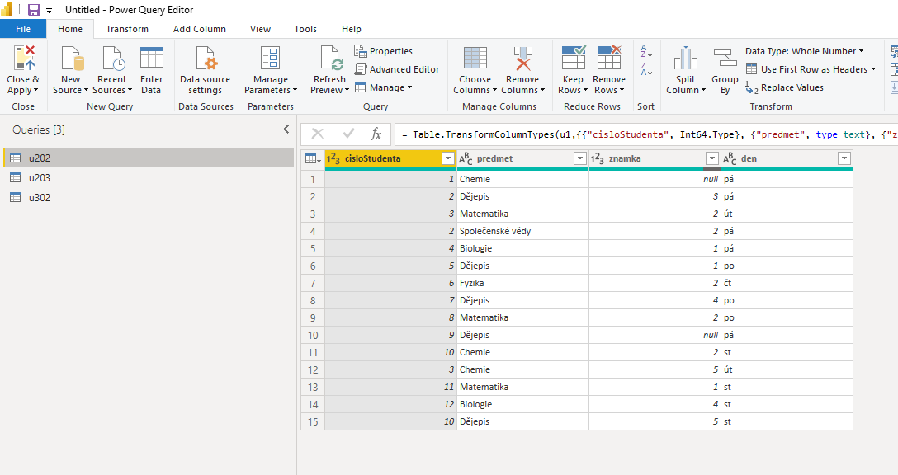{.fig}

Nyní bychom mohli pomocí nástrojů Power Query mohli provést stejné transformace (propojení zdrojů, filtrování, případně agregace), abychom se dostali k obdobným výsledkům jako v předchozí části. Níže je například vidět dialog na pro spojení jednotlivých datových souborů.

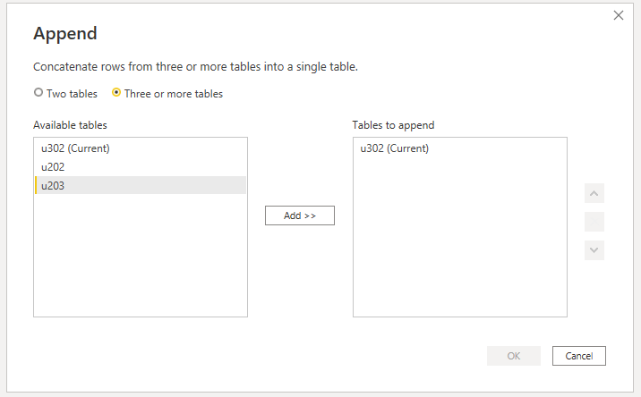{.fig}

Efektivnější ale bude využít již připravený kód v jazyce Python a v Power BI pracovat až s připravenými výsledky. Smažme tedy všechny vytvořené dotazy a přidejme nový skript, ze kterého vybereme pouze dotaz `maturita`.

```
import pandas as pd

u202 = pd.read_csv("https://kodim.cz/czechitas/progr2-python/python-pro-data-1/agregace-a-spojovani/assets/u202.csv")
u203 = pd.read_csv("https://kodim.cz/czechitas/progr2-python/python-pro-data-1/agregace-a-spojovani/assets/u203.csv")
u302 = pd.read_csv("https://kodim.cz/czechitas/progr2-python/python-pro-data-1/agregace-a-spojovani/assets/u302.csv")
u202['mistnost'] = 'u202'
u203['mistnost'] = 'u203'
u302['mistnost'] = 'u302'
maturita = pandas.concat([u202, u203, u302], ignore_index=True)
```

Po vyhodnocení výsledků maturity stačí, abychom tabulky propojili dohromady, 
agregace budou vypočteny automaticky při tvorbě vizualizací. Proto klikneme na tlačítko `Close & Apply`.

*Poznámka:* Pokud bychom se k editaci skriptu chtěli vrátit, klikneme na ikonku ozubeného kola v řádku `Source` v panelu napravo.

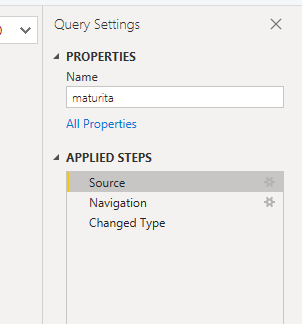{.fig}

[[[ excs Cvičení
- registrace
- registrace-2
]]]

[[[ excs Bonusová cvičení
- registrace-3
]]]

## Vizualizace v Pythonu

S pomocí Pythonu můžeme přidat i vizualizace, které budou interaktivně využívat data z dotazů. Pro vytvoření vizualizace klikneme v nabídce vizualizací na možnost `Python visual`. Následně v menu vpravo vybereme sloupce, se kterými chceme pracovat. Pro vybrané sloupce je vhodné nastavit agregaci jako průměr, abychom nemuseli agregaci řešit v kódu.

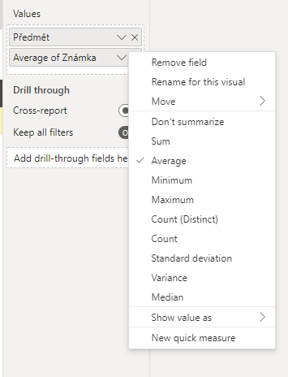{.fig}

Následně se nám zpřístupní editor kódu.

Pro vytvoření obrázku a souřadnicových os použijeme funkci `subplots()`. Pokud nezadáme žádné parametry, `matplotlib` vytvoří jednu souřadnicovou osu, tj. počítá pouze s jedním grafem na obrázek.

```py
import matplotlib.pyplot as plt
fig, ax = plt.subplots()
```

Pro data o registracích uživatelů provedeme porovnání, jaké marketingové kanály jsou nejdůležitější pro různé skupiny uživatelů. K tomu nejprve potřebujeme provést nový typ agregace, tzv. pivot (nebo také kontingenční) tabulku. Tu vytvoříme pomocí funkce `pivot_table()`. Funkci musíme říct, který sloupec bude použitý jako popisek řádku (parametr `index`), popisek sloupců (parametr `columns`), který sloupec má být použitý pro hodnoty (můžeme zvolit třeba `ip_address`) a funkci pro agregaci (využijeme funkci `len`, což je obecná funkce pro výpočet délky řetězce nebo seznamu).

```py
import pandas
dataset = pandas.read_json("https://raw.githubusercontent.com/pesikj/progr2-python/master/python-pro-data-1/power-bi/assets/user_registration.json")
df_actual_pivot = pandas.pivot_table(dataset, values="age_group", index="marketing_channel", columns="ip_address", aggfunc=len)
print(df_actual_pivot)
```

Vytvořená tabulka je připravená pro grafické zobrazení.

```
age_group                18-29  30-44  45-60   60+
marketing_channel
Friend's recommendation   1795   2268   1423   822
Newspapers or magazine    1052   1397    887  3325
Outdoor                   1097   1401   3318   484
Social network            6738   7186   1433   824
Television                1407   1809   1111   691
```

Využijeme vizualizaci pomocí teplotní mapy, což je zobrazení blízké pivot tabulce, jednotlivé hodnoty jsou ale graficky podbarveny.

Celý kód pro tvorbu vizualizace tedy je:

```py
import matplotlib.pyplot as plt

df_actual_pivot = pandas.pivot_table(dataset, values="ip_address", index="marketing_channel", columns="age_group", aggfunc=len)
fig, ax = plt.subplots()

plt.xticks(range(df_actual_pivot.shape[1]), df_actual_pivot.columns)
plt.yticks(range(df_actual_pivot.shape[0]), df_actual_pivot.index)

plt.imshow(df_actual_pivot, cmap ="viridis")
for i in range(df_actual_pivot.shape[0]):
    for j in range(df_actual_pivot.shape[1]):
        text = ax.text(j, i, df_actual_pivot.iloc[i, j],
                       ha="center", va="center", color="w")
plt.show()
```

[[[ excs Cvičení
- krabicovy-graf
]]]

[[[ excs Bonusové cvičení
- dalsi-vizualizace
]]]
