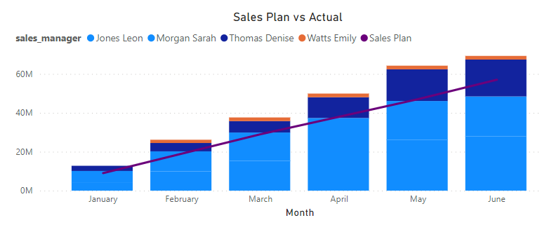
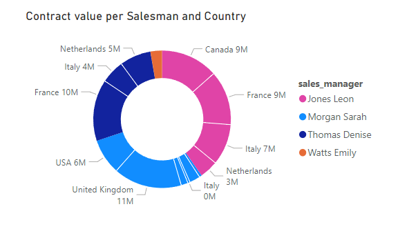
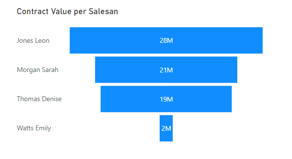
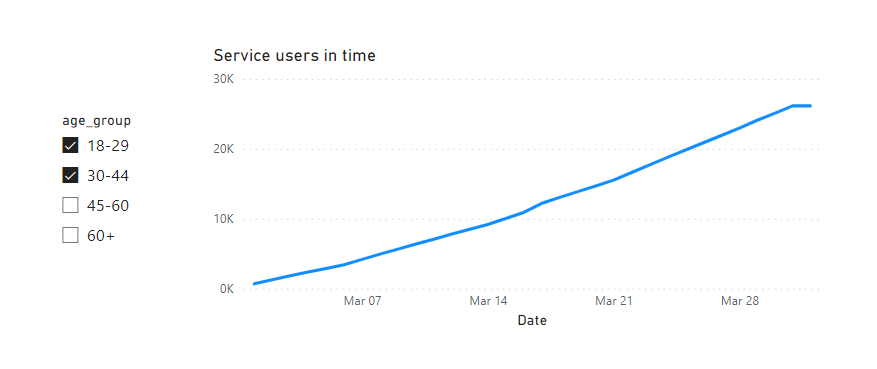
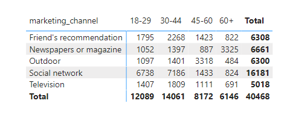
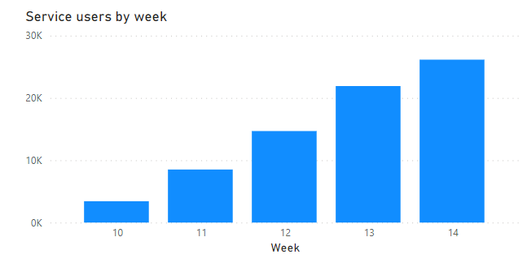
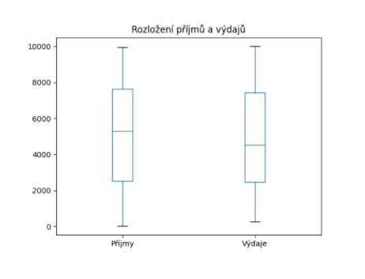
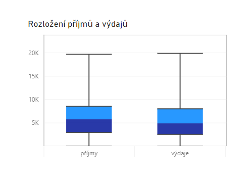

## Legenda

Je třeba přetáhnout sloupec `Sales Manager` do pole `Line values`. Volby `Data labels` a `Total labels`jsou v menu `Format your visual` dole. Musíte mít vždy označenou vizualizaci, abyste mohli měnit její nastavení (označení = kliknout na ni :-) ).



## Donut

Na začátku je třeba vložit vizualizaci typu `Donut chart` a přetáhnout jednotlivá pole. To, jestli u popisků detailů vidíme popisek, hodnotu a podíl v procentech, je určeno polem `Options` v menu `Data labels`.



## Funnel

Opět stačí přetáhnout jednotlivá pole.

Doporučil bych vypnout volbu `Display conversion rate label`, ta se pro tao data příliš nehodí.



## Barvy

Barevné schéma se změní po kliknutí na nové schéma z palety. Po nahrání nového schématu z galerie se nové schéma objeví v paletě schémat a report se do něj automaticky přepne.

## Registrace

Skript na nahrání dat je

```py
import pandas
user_registration = pandas.read_json("https://raw.githubusercontent.com/pesikj/progr2-python/master/python-pro-data-1/power-bi/assets/user_registration.json")
print(user_registration)
```

- Kopírování sloupce - kliknu na něj pravým tlačítkem a dám `Duplicate column`. Převod klinutí pravým tlačítkem a vyberu možnost `Change type` -> `Date`.
- Další dva body jsou popsané v zadání.
- Odstranění duplicity - kliknu pravým tlačítkem na sloupec a vyberu možnost `Remove Duplicates`. Duplicity se odstraňují podle vybraného sloupce.
- Na poslední bod je možné použít sloupcový, koláčový či donut graf. Asi bych intuitivně doporučil donut.

Výběr více polí lze ovlivnit v menu `Format your visual` -> `Slicer settings` -> `Selection`.



## Zdroje a skupiny

Stačí vložit matrix, do `Rows` dát `age_group`, do `Columns` `marketing_channel` (nebo obráceně), do `Values` `email`. Pokud chci počty unikátních záznamů, vyberu `Count (Distinct)`.



## Registrace po týdnech

V Power Query vyberu `Add column` -> `Custom column`. Funkce pro přidání je `Date.WeekOfYear([date_time])`. 



## Krabicový graf

U `Ammount` je potřeba zvolit `Don't summarize`. Skript na vložení grafu je níže.

```py
import matplotlib.pyplot as plt
import pandas

fig, ax = plt.subplots()
prijmy = dataset[dataset["amount"] > 0].reset_index()
vydaje = dataset[dataset["amount"] < 0].reset_index()
dataset = prijmy["amount"].to_frame(name="Příjmy")
dataset["Výdaje"] = abs(vydaje["amount"])
dataset.plot(kind="box", ax=ax)
ax.set_title("Rozložení příjmů a výdajů")
plt.show()
```



# Další vizualizace

Přidání vizualizace je popsáno v zadání. Pro vložení do reportu je třeba použít tlačítko `Add`.

Tlačítko `Conditional Column` je na záložce `Add Column` v Power Query. Je to klasická podmínka, takže stačí přidat sloupec např. s názvem `transaction_type`. Pokud je `amount > 0`, vložte text `income`, jinak `expense` (či jakýkoli jiný text). U vizuálu pak přetáhněte `bank_id` do pole `Axis`, `transaction_type` do `Axis Category 1` a `amount` do `Value`. Velká tečka jde vypnout pomocí volby `Dot` ve `Format your visual`, jdou vypnout i "malé tečky" `Dots`, barvy jdou nastavit v menu `Box options`.


